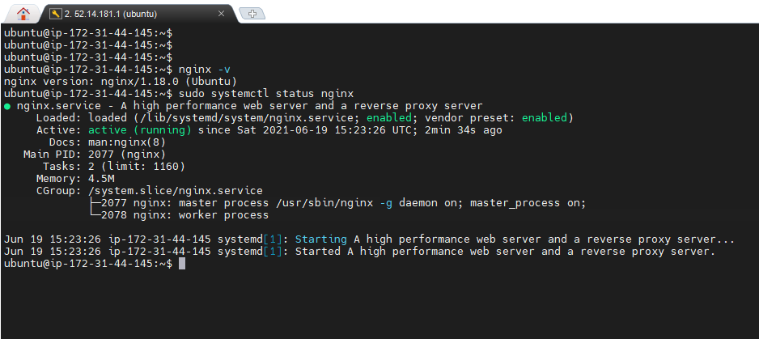
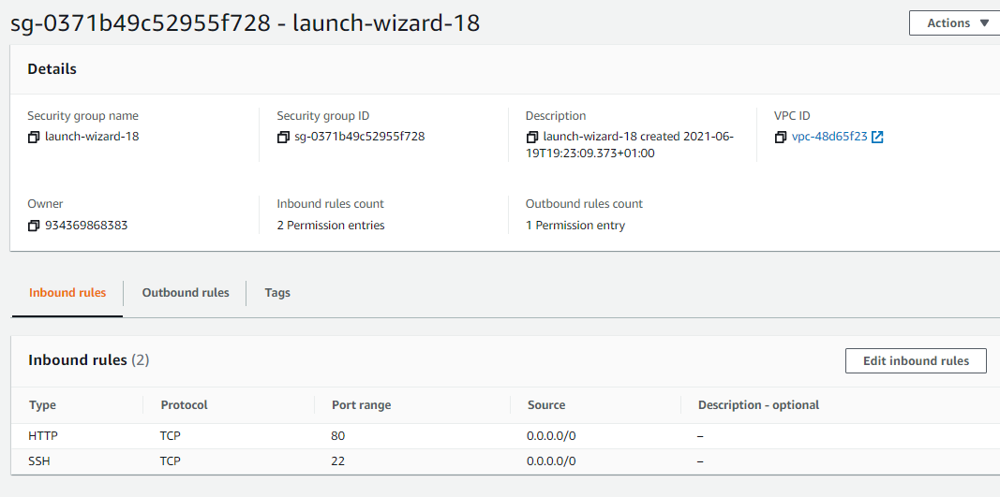
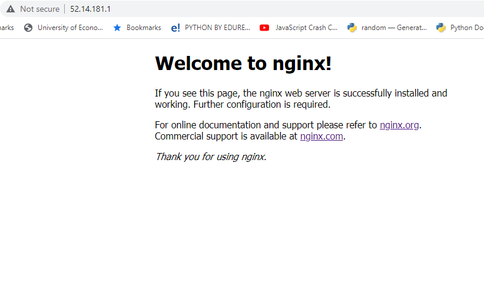
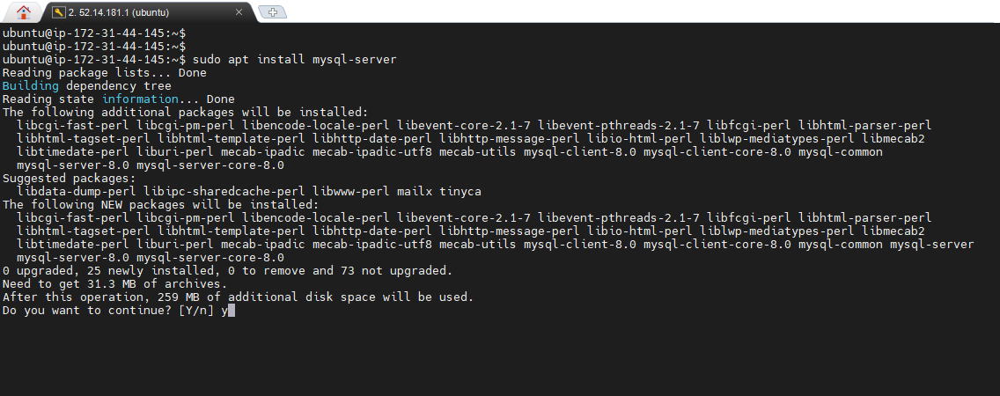
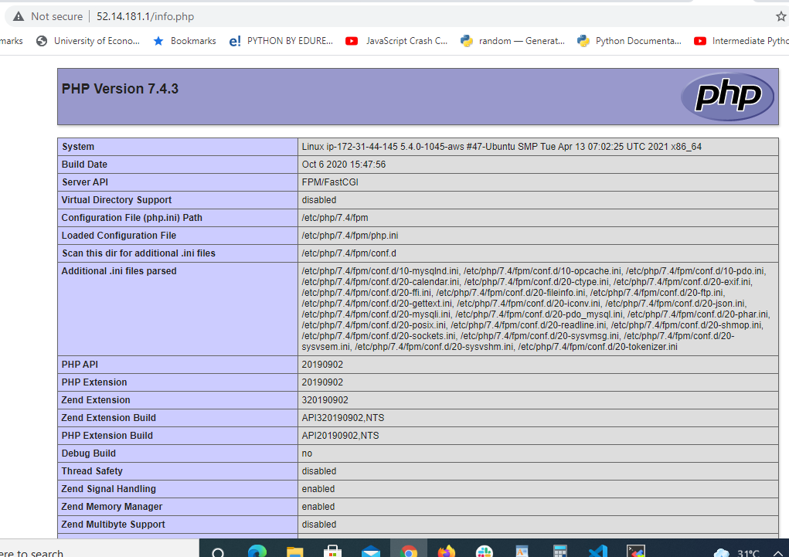
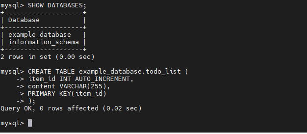

# __WEB STACK IMPLEMENTATION USING LINUX, NGINX, MYSQL AND PHP (LEMP)__

This project was completed using `Linux`, `Nginx`, `MySQL server` and `PHP`. The objective was to host more than one domain name on a single server and retrieve data from MySQL database with PHP.

1. __Install Nginx on Linux terminal.__

     Nginx installed as shown below using the IP address or DNS name of the machine using port 80. 

2.  __Install MysQl Server__

3. __Install PHP__ 
This to run code and other dependencies like PHP FastGCI and php-mysql. 
4. __Configure Nginx to use the PHP processor.__

    Created server block to encapsulate configuration details and host more than one 
domain on a single server
5. __Test PHP with Nginx.__

6. __Retrieve data from MySQL database with PHP.__

__Credit to:__

[Darey.io](https://darey.io)

